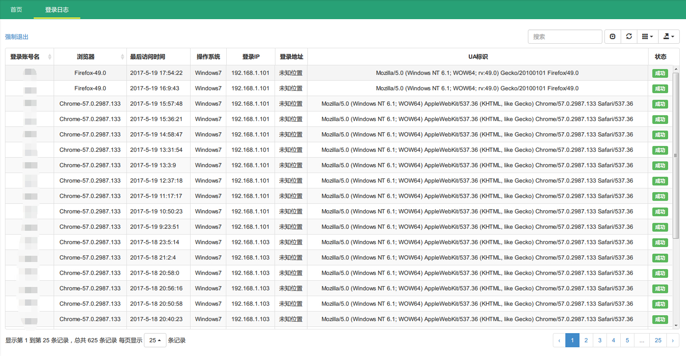
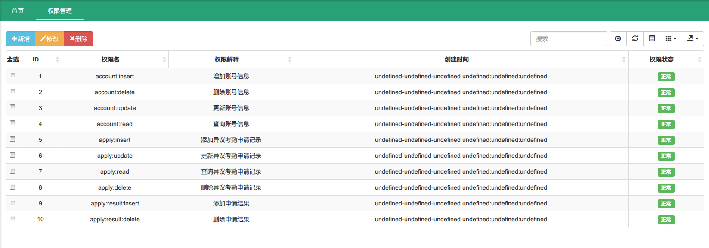

# manager
江西现代学院软件技术协会管理系统，采用SSM框架进行开发，功能正在开发中。。。。

## 项目的起因

   做这个项目的主要原因就是巩固下现有阶段所学的知识，知识点学太多了容易忘记。客观上就是在社团里面发觉有时候考勤是一件比较麻烦的事情，特别是像社团考勤需要用纸张进行填写，然后还需要人工去统计每次缺勤的人数或者是正常考勤的人数，最后到了一定阶段对缺勤次数过多的成员踢出协会。中间有一个比较大的工作量，利用现学的知识我觉得我们可以尝试去写一个半自动化基于网络的协会管理软件，可以减轻在管理方面的工作量。
   
   因为去年已经尝试写过一个类似的[基于SSH的社团管理系统](https://github.com/Sunybyjava/employeeManager)，所以这个项目应该来说有一部分是相类似的，写起来也更有思路，反正也是边做边学
   
## 项目环境搭建

### 生产环境
* **操作系统** : Ubuntu 17.04 
* **IDE** ：IntelliJ IDEA 2016.2.5 x64 像是个全家桶，很多工具都给你安装好了，像自带数据库连接工具，SSH连接工具等等，基本就是开箱即用，跟Eclipse相比的话各有各的好处
* **JDK** : JDK1.8 (务必使用1.8进行构建，否则将会构建失败)
* **Web容器** ： Tomcat 8.0
* **数据库** ：Mysql-5.6.17-winx64    轻量级的数据库
* **依赖管理工具** : Maven  挺好上手的一个工具，管理jar包真的很方便

--- 
### 主要框架
* **Spring 4.3.6.RELEASE** : 差不多是必选的，全家桶   
  [Spring官方网站,里面的文档跟Demo是学习的最佳方法](https://spring.io/)  
  [Github工程，如果你有能力的也可以参与](https://github.com/spring-projects)
* **Springmvc 4.3.6.RELEASE**: 跟Spring可以无缝集成，比较的轻量灵活，支持Restful风格，只是浏览器目前有些请求不支持，可以用别的办法达到我们的目的。

  [官方英文文档,英语好的肯定没问题，建议阅读](https://docs.spring.io/spring/docs/current/spring-framework-reference/html/mvc.html)
  
*  **Mybatis 3.4.1** : 半自动的锋利匕首，可以自己自定义SQL语句，可能比Hibernate更容易入手  ，官方文档有五种语言版本，应该是全球各地的爱好者自发更新的  
[Mybatis官方中文文档](http://www.mybatis.org/mybatis-3/zh/)  
[Mybatis官方英文文档](http://www.mybatis.org/mybatis-3/)  
[Mybatis在Github上的项目](https://github.com/mybatis/)  
[整合Spring跟Mybatis的方法](http://www.mybatis.org/spring/zh/)  

*  **~~Shiro~~**: Apache基金会下的权限管理框架，比较容易扩展，使用也简单，不过官方的文档不是很友好  
[shiro官方站点](https://shiro.apache.org/) 

* **sf4j** :可以使用多种日志系统，无缝切换，使用的是 **log4j**，简单好用  
[sf4j官方站点](https://www.slf4j.org/)  
[log4j官方站点](https://logging.apache.org/log4j/)  

* **c3p0** : 优秀的开源数据库连接池，比较常用的  
[c3p0官方站点，比较简洁化](http://www.mchange.com/projects/c3p0/)

* **Jackson** ：Json转换工具，可以很轻松地实用  
[Github上的Jackson](https://github.com/FasterXML/jackson)  

* **junit** ：老牌的单元测试工具了，可以提高你的代码质量  
  [Github上的junit4工程](https://github.com/junit-team/junit4)  
  [junit官方站点](http://junit.org/junit4/)

* **gson** : Google出的一个新型的json转换工具  
[Github上的gson](https://github.com/google/gson)

* **poi** ：apache下开源工具，对微软的Office文档进行操作，比较常用的应该就是操作Excel文档了   
[Apache官方的POI使用文档文档](https://poi.apache.org/)

* **Apache下的一些好用的工具** :这里就不一一列举了，像文件上传之类的

* **mybatis-generator-maven-plugin** ：mybatis官方出的一个工具，可以自动对数据库表产生实体类，mapper接口文件，mapper.xml文件以及一些常用的查询语句，提高你的开发效率，虽然IDEA自带了一个自动生成工具  
[插件官方地址,介绍的已经很明白了，建议Maven环境下使用](http://www.mybatis.org/generator/running/runningWithMaven.html) 

>  项目中使用的jar包可以在pom.xml文件中查看  

---


### 目前的效果图


- 考勤记录页面  


- 有异议的考勤记录申请   

 
- 审批结果页面  

  
- 成员管理页面  


- 账号角色管理页面  


- 登录日志查看界面  


- 操作日志查看界面  

  
- 权限分配页面   


---
## 项目跑起来

### 下载  

`Download Zip`或者`git clone`
``` shell
	git clone https://github.com/Sunybyjava/manager.git
```

### 快速开始   

#### 导入

建议使用IDEA，eclipse也没问题
新建或者配置一个mysql数据库，根据数据库信息修改`src/main/resources/db.properties`文件。注意修改的有账号密码，以及连接的数据库名  

建议导入IDEA中运行，***请注意JDK必须使用1.8***，项目中很多有些地方使用1.8的语法，低于**1.8**将会报错。Eclipse也可以Import Project后修改部分属性达到一样的效果  

使用Maven解决依赖，建议修改Maven在线仓库地址为阿里云源，国内的速度还是挺不错的:
```
  <mirror>
        <id>nexus-aliyun</id>
        <mirrorOf>*</mirrorOf>
        <name>Nexus aliyun</name>
        <url>http://maven.aliyun.com/nexus/content/groups/public</url>
    </mirror> 
```

#### 数据库的创建
数据库暂时分为15张表，将会根据项目的使用动态添加数据库表

##### 快速导入数据库 (推荐)
在根目录下[sql](sql/)文件夹下有一个数据库脚本，使用Mysql控制台或者第三方工具直接导入到数据库就可以了，这里数据库的名字叫做**manager**，

##### 自己手动导入数据库


### 运行

  经过前面的步骤后，应该是运行起来是没有问题的，部署到你的**Tomcat**里面去吧，如果部署成功的话，在浏览器里面输入登录页面的地址，在我这里登录地址是***http://localhost:8080/base/loginPage.html**，如果你有项目名的话，请在域名**/base**前面添加你的项目名，也就是
> http://localhost:8080/项目名/base/loginPage.html,如果没问题的话你应该就会看到登录页面了

- 登录页面的效果图  


#### 添加数据库信息

1. 首先你要想登录的话你要往数据库里面添加账号信息，往**Account***表中添加一条信息，这里有一份实例的SQL语句，你可以直接复制过去使用，这里往数据库里面插入了一个账号为【test】，密码为【test】，其他的信息你可暂时不用关注，然后插入成功后你就可以输入账号密码进行登录了，请注意验证码的填写
```
INSERT INTO `manager`.`account`(`account_id`,`account_name`,`account_password`,`account_phone`,`account_email`,`account_status`,`account_role_id`,`account_member_id`) VALUES ( NULL,'test','test','12345678901',NULL,'1','0',NULL);
````


- 登录后的主页面  


---

#### 后续你应该做的事情

##### 继续往数据库里面添加数据，已达到测试的目的

根据每张数据库表的不同作用，你可以添加相对应的数据

- 你应该添加【协会成员】的信息给你刚刚创建的账号，数据库表为```member```这里我们创建了一个成员信息，成员的名字为【测试账号】，班级为【未知班级】，性别为【1也就是男】，届级【2016，也就是2016届】，成员的状态【1，也就是正常】，部门【0，看你对应的部门是哪个】，成员的角色【0，也是看你对应的角色是什么】，成员的管理员是【NULL,也就是暂时没有管理员】
```
INSERT INTO `manager`.`member`(`member_id`,`member_name`,`member_class_name`,`member_sex`,`member_grade_number`,`member_status`,`member_department_id`,`member_role_id`,`member_manager_id`) VALUES ( NULL,'测试账号','未知班级','1','2016','1','0','0',NULL);
```
- 上一条语句你可能执行不成功，原因呢就在于有外键约束，你要插入的部门编号为【0】，但是你部门表【department】中添加一条数据：

```
INSERT INTO `manager`.`department`(`department_id`,`department_name`) VALUES ( '0','测试部门');
```
-  然后你还要新建一条成员角色，往成员角色表【member_roles】添加一条数据：
```
INSERT INTO `manager`.`member_roles`(`member_role_id`,`member_role_name`) VALUES ( '0','测试成员角色');

```
- 然后你再执行第一条插入成员信息的**SQL**语句应该是成功的，这时候你应该把你的成员信息绑定到账号信息里面去，我们把一开始插入的账号信息中空出来的成员信息给绑定上去：
```
UPDATE `manager`.`account` SET `account_member_id`='你的成员信息主键ID' WHERE `account_id`='你的账号信息表中的主键ID';

```
- 这时候你的账号跟成员就绑定在一起了，你需要继续给你的数据库里添加各种信息，你需要查看哪个功能的信息你就要往对应的数据库表里面插入数据

## 项目中的一些注意事项


## 推荐的一些博客以及参考资料


## 写在最后
 
可能因为自身技术能力的问题，有些地方设计的有缺陷请谅解，如果您偶然看到了这个项目，并且对项目中存在的问题有所了解或者有不完善的地方，欢迎您发issue或者电子邮箱[sunybyjava@gmail.com](sunybyjava@gmail.com)帮助我完善这个项目我将万分感谢！ 


